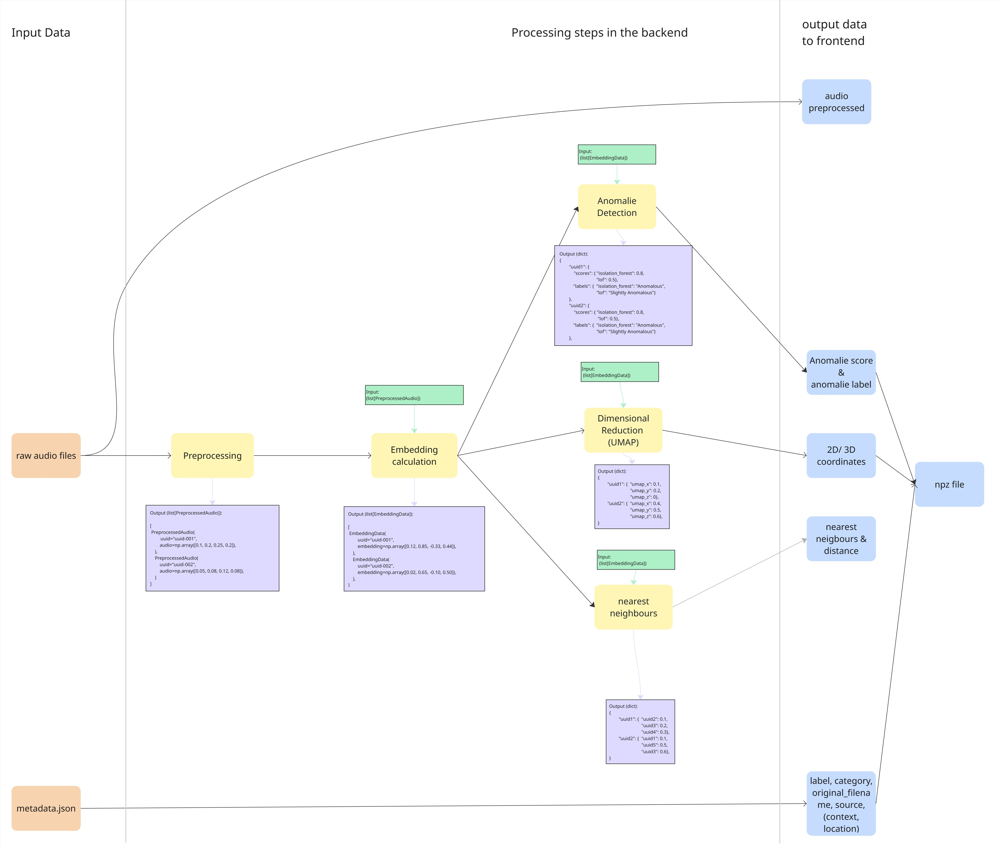

# **DATA-PROCESSOR**

# Overview

This repository is part of the audio-explorer project. More information about the overall project can be found in the backend repository:

https://github.com/ZDDduesseldorf/audioexplorer-backend

The data processor processes raw audio files and generates a data overview for each recording. The generated data is then imported into the backend database, During processing it:

- preprocesses the audio files,
- computes audio embeddings,
- calculates UMAP coordinates,
- determines nearest neighbours,
- performs anomaly detection, and
- generates metadata required for the data overview.

After processing, the categories and the data overview are imported into the backend database via the backend API.

## Running the Application with Docker

The data processor depends on the backend application. Therefore, make sure the backend is running before starting this application, as the processed data is imported directly into the backend database.

To build and start the application, run:

To start the application use:

```bash
git clone https://github.com/ZDDduesseldorf/audioexplorer-data-processor.git
docker compose up --build
```

## Default Directory Structure

By default, the application expects the following directory structure. All paths can be customized using environment variables (see the configuration section).

**Single dataset**

```text
app/
data/
├── raw_audios/
│   ├── metadata.json
│   ├── uuid1.wav
│   ├── uuid2.wav
│   └── uuid3.wav
├── processed_audios/
└── category_list.json
```

**Multiple datasets**

Subdirectories inside `raw_audios` are also supported.

```text
app/
data/
├── raw_audios/
|   ├── folder1/
│       ├── metadata.json
│       ├── uuid1.wav
│       ├── uuid2.wav
│       └── uuid3.wav
|   ├── folder2/
│       ├── metadata.json
│       ├── uuid4.wav
│       ├── uuid5.wav
│       └── uuid6.wav
├── processed_audios/
└── category_list.json

```

## Output Files

After processing, the default output directory contains the processed audio files, data_overview.npz and category.npz:

```text
processed_audios/
├── uuid1.wav
├── uuid2.wav
├── uuid3.wav
|── category.npz
└── data_overview.npz
```

`processed_audios`: The processed_audios directory contains the preprocessed audio files used by the Audio Explorer.  
`data_overview.npz`: Contains the generated data for each audio file, including:

- UUID
- UMAP coordinates (x, y, z)
- Label
- Category
- Original filename
- Source
- Additional information
  - context
  - location
- Anomaly detection
  - Isolation Forest score
  - Isolation Forest label
  - Local Outlier Factor (LOF) score
  - LOF label
- Nearest neighbours
  - UUID
  - Distance

`category.npz`: Contains the available categories with the following fields:

- id
- key
- display_name

## Configuration

Default paths are defined in `config.py` and can be overridden using environment variables.

| Environment Variable           | Description                                                      | Default           |
| ------------------------------ | ---------------------------------------------------------------- | ----------------- |
| `AUDIOEXPLORER_DATA_DIR`       | Base data directory used to derive the default paths above.      | testdata          |
| `RAW_AUDIO_FOLDER`             | Path to the directory containing the raw audio files.            | raw_audios        |
| `METADATA_FILENAME`            | Name of the json-file that includes the metadata                 | metadata.json     |
| `TARGET_AUDIO_FOLDER`          | Target directory where the preprocessed audio files are written. | processed_audios  |
| `TARGET_FILENAME_DATAOVERVIEW` | Target filename of the generated data overview npz-file          | data_overview.npz |
| `TARGET_FILENAME_CATEGORYS`    | Target filename of the generated category npz-file               | category.npz      |

If only `AUDIOEXPLORER_DATA_DIR` is specified, all other paths are automatically derived from it using the default directory layout.

# Pipeline

The pipeline consists of all processing steps required to transform raw audio recordings into the final dataset used by the Audio Explorer.

The diagram below illustrates the complete processing pipeline, including the execution order of each step as well as the corresponding input and output formats.



Further details about each processing stage are provided in the following sections.

## Datasets
The current dataset is assembled from multiple sources. Its foundation is a set of data provided directly by our cooperating researchers at Oxford University. This dataset was crucial in defining the project's evaluation criteria and, therefore, guided the search for complementary datasets.<br>
<br>Other open-source datasets:<br>
  [Deeply Inc.](https://www.openslr.org/99/)<br>
  [Nonspeech7k](https://doi.org/10.5281/zenodo.6967442)<br>
  [Vocalsound](https://doi.org/10.1109/ICASSP43922.2022.9746828)<br>
  [VIVAE](https://doi.org/10.5281/zenodo.4066235)<br>


## Data Formatting
All audio files are stored in WAV format. On import, each file is renamed to a unique identifier (UUID), ensuring consistent, collision-free filenames across all combined data sources. A JSON index is maintained alongside the audio files to track metadata and category/label assignments.

## Metadata
The audio files used have been enhanced with additional information (metadata) that is readable by both humans and machines. The number of descriptive tags can vary depending on the source of the audio file, but at a minimum require the following:
- uuid
- filename
- label
- category
- source

The displayed image shows an example (source: researchers at Oxford University): <br>
<br>


This process was made possible with support/import from the Python library [pytaglib](https://pypi.org/project/pytaglib/).

## Categories
Categories group together audio files that share a strong resemblance ("alikeness"). This kind of classification can be noticed in the metadata as well as in the frontend-visualisation.

Note "Other":<br> This value is used in case a audio file doesn't fit any existing category, as a result any specifying information will be stored in the label-tag (no matter the origin/source).

Note "Unknown":<br> The value "Unknown" represents a non-final variable. Audio files assigned to this category are intended for interactive measurement by frontend users.

For a complete overview, check:
[category_list.json](https://github.com/user-attachments/files/30744010/category_list.json)


## Labels
Labels are hierarchically subordinate to categories, providing even more information.

Note "To be defined":<br> This label is used when a audio file originates from an external dataset and can be matched to the existing categories (set by the dataset of Oxford University), but is missing any further details.

For a complete label-overview, check: [new_ontology.json](https://github.com/user-attachments/files/30744195/new_ontology.json)


## Audio Preprocessing
### Overview
Audio preprocessing is the first step in the processing pipeline. It prepares raw audio files for further analysis by standardizing sample rates, filtering invalid audio files, reducing noise, and ensuring consistent audio quality. 

### Processing Steps
The preprocessing pipeline applies the following transformations to each audio file in sequence:

1. Mono Conversion & Resampling
<br>
Audio files are converted to mono and resampled to 48,000 Hz using Librosa resampling. This ensures compatibility with the CLAP embedding model that requires mono, 48 kHz input.

2. Length Filtering
<br>
Filters out audio files that do not meet duration requirements:
<br>
Minimum duration: 0.1 seconds <br>
Maximum duration: 30 seconds <br>
Audio files outside this range are excluded from further processing and logged as rejected samples.

3. Silence Filtering
<br>
Removes audio files that contain insufficient acoustic content by analyzing the Root Mean Square (RMS) energy. Files with RMS energy below the threshold of 0.005 are filtered out, as they typically contain only silence or very low-level noise.

4. Noise Reduction
<br>
Applies adaptive noise reduction to suppress background noise. A noise floor is estimated from quiet parts of the audio, and samples below this threshold are soft-suppressed based on the configured strength.

### Configuration

**Model Dependencies:**
The preprocessing parameters are optimized for the CLAP (Contrastive Language-Audio Pre-training) embedding model from Hugging Face (laion/larger_clap_general). If using a different embedding model, adjust these parameters accordingly.

Default preprocessing parameters can be modified via environment variables or by editing `audio_config.py`:

| Parameter | Default | Description |
| --- | --- | --- |
| `target_sample_rate` | 48,000 Hz | Target sample rate for resampling - must match model requirements |
| `apply_length_filter` | true | Enable/disable duration filtering |
| `min_duration_seconds` | 0.1 | Minimum audio duration in seconds |
| `max_duration_seconds` | 30.0 | Maximum audio duration in seconds |
| `apply_silence_filter` | true | Enable/disable silence filtering |
| `silence_rms_threshold` | 0.005 | RMS energy threshold for silence detection |
| `apply_noise_reduction` | true | Enable/disable noise reduction |
| `noise_reduction_strength` | 1.0 | Strength factor for noise reduction (0-1) |


### Input & Output

**Input**: Raw audio files in various formats (WAV, MP3, FLAC, etc.) with different sample rates, typically sourced from `raw_audios/` directory with accompanying `metadata.json`.

**Output**: Preprocessed mono audio files saved to `processed_audios/` directory in WAV format at 48 kHz. Only audio files that pass all filtering criteria are output.

### Impementation Details
The audio preprocessing is implemented in `app/processing/audio/`:

- `audio_config.py` - Configuration parameters
- `resampler.py` - Sample rate conversion using Librosa
- `filter.py` - Duration, silence, and noise reduction filters
- `loader.py` - Audio file loading
- `saver.py` - Preprocessed audio file saving

## Embedding calculation

Embeddings turn each preprocessed waveform into a fixed-length numeric vector. All downstream steps (nearest neighbours, UMAP, anomaly detection) operate on these vectors only — never on the raw audio.

### Model

| Property | Value |
| --- | --- |
| Model | `laion/larger_clap_general` (CLAP — Contrastive Language-Audio Pre-training) |
| Source | Hugging Face `transformers` (`ClapModel` + `ClapProcessor`) |
| Revision | `ada0c23a36c4e8582805bb38fec3905903f18b41` (pinned for reproducibility) |
| Required input | mono, 48 kHz |
| Output dimension | 512 |
| Device | CPU |

- The model is loaded and cached by the `ModelManager` (`model_manager.py`).
- Loading is lazy — `load()` is a no-op once the model is in memory.
- `model.eval()` is set; inference runs inside `torch.no_grad()` (no gradients, lower memory).

### Processing Steps

1. Feature extraction
<br>
The `ClapProcessor` converts the waveform into the mel-spectrogram features expected by CLAP. Padding and truncation to the model's fixed input window are handled internally.

2. Forward pass
<br>
`model.get_audio_features(...)` produces the projected audio embedding under `torch.no_grad()`.

3. Conversion
<br>
The result is moved to CPU, converted to NumPy and squeezed to a flat vector of shape `(512,)`.

- Files are processed **one at a time** (batch size 1). `compute_embeddings_batch()` is a convenience wrapper that loops and stacks — it does not batch on the GPU/CPU level.
- Embeddings are computed for the whole corpus in a single run, so all datasets share one common embedding space.

### Input & Output

**Input**: `list[PreprocessedAudio]` — one entry per audio file, each holding a UUID and the preprocessed mono 48 kHz waveform as `np.ndarray`.

**Output**: `list[EmbeddingData]` — one entry per audio file, each holding the UUID and a `np.ndarray` of shape `(512,)` (float32, ≈2 KB per file).

### Implementation Details

The embedding calculation is implemented in `app/processing/embeddings/`:

- `model_manager.py` - Model/processor loading and in-memory caching
- `embedding_service.py` - Single, batch and list-based embedding computation

## Nearest Neighbours

Nearest neighbours describe, for every audio file, which other files sound most similar to it. The result is used by the Audio Explorer to navigate between related recordings.

### Method

- Implementation: `sklearn.neighbors.NearestNeighbors`
- Metric: **cosine distance** (`1 - cosine similarity`)
  - `0.0` = identical direction in embedding space
  - `1.0` = maximally different
- Cosine compares the direction of a vector.
- Every audio file is compared against all the others.

### Parameters

| Parameter | Default | Description |
| --- | --- | --- |
| `k` | 30 | Number of neighbours stored per audio file |
| `n_neighbors` | `min(k + 1, N)` | One extra neighbour is requested to compensate for the self-match |
| `metric` | `cosine` | Distance measure in embedding space |

- Every point is its own closest neighbour (distance `0.0`), so the first result is skipped and exactly `k` real neighbours remain.
- Distances are rounded to 5 decimal places.
- Cosine distance forces a brute-force search in scikit-learn, so runtime grows quadratically with the number of audio files. (needs to be changed, when the amount of audiofiles drastically increases)

### Input & Output

**Input**: `list[EmbeddingData]`, stacked into an `(N, 512)` matrix.

**Output**: A dictionary mapping each UUID to its neighbours, ordered by ascending distance.

```json
{
    "uuid1": {
        "uuid7": 0.04123,
        "uuid3": 0.09877,
        "uuid9": 0.15402
    }
}
```

Stored in `data_overview.npz` as a JSON string in the `nearest_neighbors` field.

### Implementation Details

Implemented in `app/processing/nearest_neighbor_service.py`.

## UMAP

UMAP (Uniform Manifold Approximation and Projection) reduces the 512-dimensional embeddings to 2D coordinates so the dataset can be displayed as an interactive scatter plot in the Audio Explorer.

### Processing Steps

1. Standardization
<br>
Some of the 512 dimensions have much larger values than others and would therefore count more when distances are calculated. `StandardScaler` rescales every dimension to the same value range, so all of them have equal weight.

2. PCA pre-reduction
<br>
`PCA` shrinks the 512 dimensions down to 50. It keeps the dimensions that differ the most between the audio files and drops the rest, which are mostly noise. Less data also means UMAP runs much faster.

3. UMAP projection
<br>
`umap.UMAP` projects the PCA output down to 2 dimensions, preserving the local neighbourhood structure of the embedding space.

### Parameters

| Parameter | Default | Description |
| --- | --- | --- |
| `n_components` (PCA) | `min(50, N-1, 512)` | Dimensions kept after PCA pre-reduction |
| `n_components` (UMAP) | 2 | Target dimensionality of the projection |
| `n_neighbors` | `min(15, N-1)` | Size of the local neighbourhood UMAP considers |
| `min_dist` | 0.8 | Minimum distance between points in the projection |
| `init` | `random` | Initialization strategy for the embedding layout |
| `random_state` | 1 | Fixed seed |

- A high `min_dist` spreads points out more evenly. This reduces visual overlap in the explorer at the cost of less tightly separated clusters.
- A low `n_neighbors` emphasizes local structure over the global layout.
- `random_state` makes runs reproducible but disables UMAP's parallelization, which increases runtime on large datasets. (needs to be reconsidered, when the amount of audiofiles drastically increases)
- UMAP is fitted once over all datasets combined, so coordinates from different sources are directly comparable.

### Input & Output

**Input**: `list[EmbeddingData]`, stacked into an `(N, 512)` matrix.

**Output**: A dictionary mapping each UUID to its coordinates.

```json
{
    "uuid1": {
        "umap_x": 4.8213,
        "umap_y": -1.2049,
        "umap_z": 0
    }
}
```

- The pipeline currently uses the 2D projection only; `umap_z` is always `0`.
- A 3D variant (`compute_umap_3d`) exists in the service but is not called by the pipeline. (not very suitable for a webpage)

### Implementation Details

Implemented in `app/processing/umap_service.py`.

## Anomaly Detection

The anomaly detection module identifies unusual audio samples based on their embedding vectors.

The complete workflow is coordinated by the `AnomalyService`, which executes two complementary anomaly detection algorithms, combines their results, assigns human-readable labels, and returns a structured output dictionary.

---

The anomaly detection pipeline utilizes two unsupervised machine learning algorithms provided by the **scikit-learn** library: **Isolation Forest** and **Local Outlier Factor (LOF)**.

Both detectors validate the input embeddings, compute anomaly scores, normalize the scores, and return structured results for further analysis and visualization.

---

The algorithms return raw anomaly scores rather than percentages. These raw values are relative model outputs and differ between Isolation Forest and LOF. To provide a consistent and interpretable representation, the scores are inverted where necessary and normalized to a shared range between **0 and 100** using Min-Max normalization.

The resulting percentage expresses the relative anomaly strength within the analyzed dataset. Finally, each normalized anomaly score is rounded to two decimal places before being added to the result dictionary.

### Isolation Forest

The Isolation Forest implementation is based on:

```python
from sklearn.ensemble import IsolationForest
```

Isolation Forest detects **global anomalies** by recursively partitioning the embedding space using randomly generated decision trees. Samples that require fewer partitions to become isolated receive higher anomaly scores.

### Local Outlier Factor (LOF)

The Local Outlier Factor implementation is based on:

```python
from sklearn.neighbors import LocalOutlierFactor
```

Local Outlier Factor (LOF) detects **local anomalies** by comparing the local density around each embedding with the density of its nearest neighbors. Embeddings located in significantly lower-density regions than their surrounding neighborhood receive higher anomaly scores.

### Score Normalization

Since the two algorithms produce scores on different numerical scales, all raw anomaly scores are normalized to a common range between **0 and 100** using Min-Max normalization. This enables a direct comparison between the outputs of both algorithms.

### Label Assignment

Normalized anomaly scores are converted into the following human-readable categories using the `AnomalyLabeler`:

- Not Anomalous
- Slightly Anomalous
- Anomalous
- Highly Anomalous

### Output

The anomaly detection service returns one result entry for each embedding.

```json
{
    "uuid1": {
        "scores": {
            "isolation_forest": 58.03,
            "lof": 88.04
        },
        "labels": {
            "isolation_forest": "Anomalous",
            "lof": "Highly Anomalous"
        }
    }
}
```

The returned dictionary contains the normalized anomaly scores and their corresponding labels for both Isolation Forest and Local Outlier Factor, indexed by the embedding UUID.
